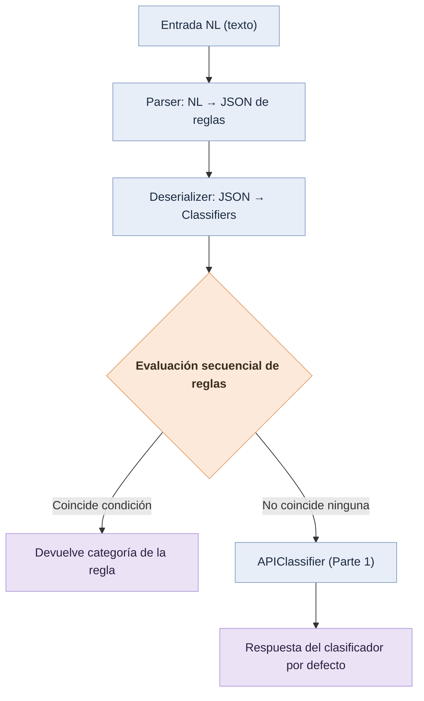

# Sistema de Clasificación Flexible

## Objetivo

Diseñar un sistema que traduzca descripciones en lenguaje natural (español/inglés) a un clasificador funcional de correos electrónicos, configurable mediante reglas simples.
El sistema admite:

* Reglas condicionales `contains` / `equals` sobre `asunto`, `cuerpo`, `remitente`.
* Reglas en lenguaje natural (p. ej.: “Si el asunto contiene ‘urgente’, clasifícalo como ‘urgente’.”).
* Un clasificador por defecto que delega en la API de la Parte 1.

---

## Estructura del proyecto

```
parte4/
├── src/
│   └── nlrules/
│       ├── __init__.py
│       ├── parsing.py           # NL → JSON de reglas
│       ├── deserializer.py      # JSON → objetos Classifier
│       └── classifiers.py       # ConditionClassifier, APIClassifier, SequentialClassifier
├── examples/
│   ├── demo.py
│   ├── demo2.py
│   ├── demo3.py
│   └── demo_profesional_1.py
├── tests/
│   └── test.py                  # tests oficiales (unittest)
├── base.py                      # interfaces base del ejercicio
├── dependencies.py              # factorías de parser/deserializer
├── requirements.txt
└── README.md
```

---

## Instalación

Se recomienda entorno virtual:

```bash
python -m venv .venv
source .venv/bin/activate        # Windows: .venv\Scripts\activate
pip install -r requirements.txt
```

**requirements.txt**

```
requests>=2.31.0
```

---

## Uso

### Ejecutar los tests oficiales

```bash
python -m unittest tests/test.py -v
# o
python -m unittest discover -s tests -p "test*.py" -v
```

Salida esperada:

```
Ran 7 tests in X.XXXs
OK
```

### Ejecutar un ejemplo

```bash
python examples/demo.py
```

Salida típica:

```
CONFIG: {'rules': [...]}
RESULT: urgente
```

---

## Configuración del clasificador por defecto (API)

`APIClassifier` puede parametrizarse mediante variables de entorno:

| Variable              | Tipo  | Valor por defecto                      | Descripción                                  |
| --------------------- | ----- | -------------------------------------- | -------------------------------------------- |
| `DEFAULT_API_URL`     | str   | `http://localhost:8000/classify-email` | Endpoint de la Parte 1                       |
| `DEFAULT_API_TIMEOUT` | float | `6.0`                                  | Timeout en segundos                          |
| `DEFAULT_API_RETRIES` | int   | `2`                                    | Reintentos ante fallo                        |
| `DEFAULT_API_BACKOFF` | float | `0.4`                                  | Base de backoff exponencial entre reintentos |
| `DEBUG_PART4`         | {0,1} | `0`                                    | Nivel de logs (1 activa DEBUG)               |

Ejemplo:

```bash
export DEFAULT_API_URL="http://localhost:8000/classify-email"
export DEFAULT_API_TIMEOUT=6
export DEFAULT_API_RETRIES=2
export DEFAULT_API_BACKOFF=0.4
export DEBUG_PART4=1
```

---

## Ejemplo de entrada NL → JSON

Entrada:

```
Asigna la categoría "regulatorio" si el remitente es "inspecciones@cnmc.es".
Si el asunto contiene la palabra "reclamación", clasificarlo como "reclamacion".
If the body contains the word "avería", classify it as "incidencia".
```

Salida (configuración JSON):

```json
{
  "rules": [
    {"type": "condition", "field": "sender", "operator": "equals", "value": "inspecciones@cnmc.es", "category": "regulatorio"},
    {"type": "condition", "field": "subject", "operator": "contains", "value": "reclamación", "category": "reclamacion"},
    {"type": "condition", "field": "body", "operator": "contains", "value": "avería", "category": "incidencia"}
  ]
}
```

---

## Diagrama de flujo (alto nivel)



---

## Diseño y consideraciones

* **Parser multilingüe (ES/EN)** con soporte para comillas tipográficas y normalización robusta (acentos, mayúsculas/minúsculas).
* **Reglas soportadas**: `equals` y `contains` sobre `subject/asunto`, `body/cuerpo`, `sender/remitente`.
* **Secuencial**: la primera regla que aplica decide; si ninguna aplica, se delega al clasificador por defecto (API Parte 1).
* **Trazabilidad**: logs activables con `DEBUG_PART4=1`.
* **Robustez**: `APIClassifier` implementa reintentos con backoff exponencial.

---

## Extensión

* Añadir nuevos operadores (e.g., `startswith`, `regex`) ampliando `parsing.py` y `classifiers.py`.
* Añadir nuevas fuentes de señal (p. ej., hora de envío) mediante nuevos campos en `Email` y reglas asociadas.
* Sustituir la llamada HTTP por un cliente gRPC si la latencia/volumen lo requiere.

---

## Autor

Gerard — Data Scientist.


