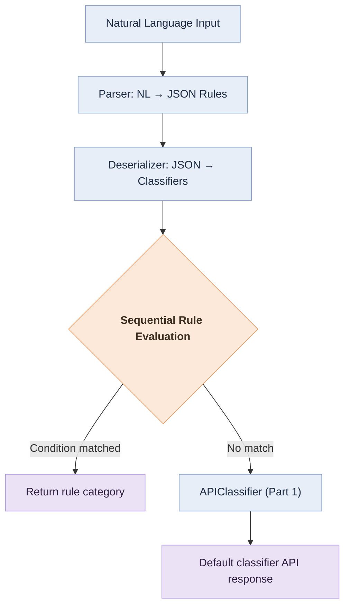

# Part 4 — Flexible Email Classification System

## Objective

Develop a system capable of translating **natural language descriptions** (in Spanish or English) into a **functional classifier** that evaluates emails according to configurable business rules.

The system supports:

* Conditional rules (`contains` / `equals`) on `subject`, `body`, or `sender`
* Natural language definitions such as:
  “If the subject contains the word *urgent*, classify it as *urgent*.”
* A **default classifier** that delegates to the API implemented in Part 1.

---

## Project Structure

```
part4/
├── src/
│   └── nlrules/
│       ├── __init__.py
│       ├── parsing.py           # Natural Language → JSON rules
│       ├── deserializer.py      # JSON → Classifier objects
│       └── classifiers.py       # ConditionClassifier, APIClassifier, SequentialClassifier
├── examples/
│   ├── demo.py
│   ├── demo2.py
│   ├── demo3.py
│   └── demo_professional_1.py
├── tests/
│   └── test.py                  # Official tests (unittest)
├── base.py                      # Provided base interfaces
├── dependencies.py              # Factory for parser/deserializer
├── requirements.txt
└── README.md
```

---

## Installation

It is recommended to work within a virtual environment:

```bash
python -m venv .venv
source .venv/bin/activate        # On Windows: .venv\Scripts\activate
pip install -r requirements.txt
```

**requirements.txt**

```
requests>=2.31.0
```

---

## Usage

### Run the official tests

```bash
python -m unittest tests/test.py -v
# or
python -m unittest discover -s tests -p "test*.py" -v
```

Expected output:

```
Ran 7 tests in X.XXXs
OK
```

### Run an example

```bash
python examples/demo.py
```

Example output:

```
CONFIG: {'rules': [...]}
RESULT: urgent
```

---

## Default API Classifier Configuration

The `APIClassifier` can be configured through environment variables:

| Variable              | Type  | Default Value                          | Description                               |
| --------------------- | ----- | -------------------------------------- | ----------------------------------------- |
| `DEFAULT_API_URL`     | str   | `http://localhost:8000/classify-email` | Endpoint from Part 1                      |
| `DEFAULT_API_TIMEOUT` | float | `6.0`                                  | Request timeout (seconds)                 |
| `DEFAULT_API_RETRIES` | int   | `2`                                    | Retry attempts on failure                 |
| `DEFAULT_API_BACKOFF` | float | `0.4`                                  | Exponential backoff base (seconds)        |
| `DEBUG_PART4`         | {0,1} | `0`                                    | Enables debug-level logging if set to `1` |

Example:

```bash
export DEFAULT_API_URL="http://localhost:8000/classify-email"
export DEFAULT_API_TIMEOUT=6
export DEFAULT_API_RETRIES=2
export DEFAULT_API_BACKOFF=0.4
export DEBUG_PART4=1
```

---

## Natural Language Input → JSON Configuration

Input:

```
Assign the category "regulatory" if the sender is "inspecciones@cnmc.es".
If the subject contains the word "complaint", classify it as "reclamation".
If the body contains the word "failure", classify it as "incident".
```

Output (JSON):

```json
{
  "rules": [
    {"type": "condition", "field": "sender", "operator": "equals", "value": "inspecciones@cnmc.es", "category": "regulatory"},
    {"type": "condition", "field": "subject", "operator": "contains", "value": "complaint", "category": "reclamation"},
    {"type": "condition", "field": "body", "operator": "contains", "value": "failure", "category": "incident"}
  ]
}
```

---

## High-Level Flow Diagram



---

## Design and Key Features

* **Multilingual parsing (ES/EN)** supporting both straight and typographic quotes.
* **Robust text normalization**: removes accents and enforces lowercase consistency.
* **Supported operators**: `equals` and `contains` for `subject`, `body`, and `sender`.
* **Sequential logic**: the first matching rule determines the result; otherwise, the default classifier is invoked.
* **Debug logging** enabled via `DEBUG_PART4=1`.
* **Resilient API calls** with retry and exponential backoff strategies.

---

## Extensibility

* New operators (e.g. `startswith`, `regex`) can be added by extending `parsing.py` and `classifiers.py`.
* Additional features (e.g. time-based rules) can be integrated by modifying the `Email` dataclass and the rule engine.
* The HTTP API call can be replaced by a gRPC client if required for performance or scalability.

---

## Author

**Gerard** — Data Scientist.
